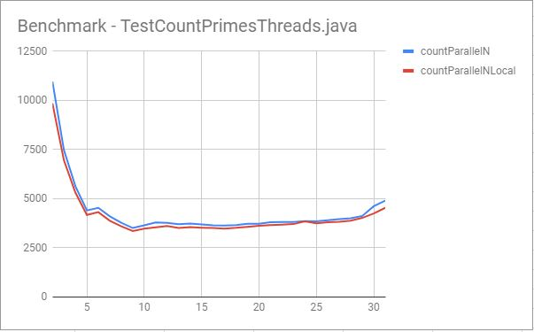

# IMPORTANT
If you would like to see the images please open ANSWERS.md with enclosed graph-x-x-x.JPG files 

# Basic info about running platform
Instead of copy pasting the same machine specification we'll just specify the name of the machine next to the results

## System - "Main machine"
- Time of this report: 9/18/2018, 17:43:26
- Operating System: Windows 10 Pro 64-bit
- System Manufacturer: Dell Inc.
- System Model: Inspiron 7559
- BIOS: 1.2.2 (type: UEFI)
- Processor: Intel(R) Core(TM) i7-6700HQ CPU @ 2.60GHz (8 CPUs), ~2.6GHz
- Memory: 16384MB RAM
- Available OS Memory: 16256MB RAM

## System - "Jet Engine"
- Date: 2018-09-17T17:39:20+0200
- OS:   Windows 10; 10.0; amd64
- JVM:  Oracle Corporation; 10.0.2
- CPU:  Intel64 Family 6 Model 60 Stepping 3, GenuineIntel; 8 "cores"
- RAM: 16 GB

# Exercise 3.1
## Part 1.
### Mark01
As written in the in the article the parallelism performed by the CPU lowered the result time into `0.0 ns`. We have decided to lower the
number of executions to see whether we get similar results => and indeed we do get similarities described in the `benchmarking`
```
 -----------------------
|Run on - "Main machine"|
 -----------------------
100 => `119.0 ns`
100_000 => `29.9 ns`
100_000_000 runs => `0.0 ns`
```
### Mark02 
We can see that our result time is slightly lower then the one in `benchmarking`, which is cause (we assume) by having a better platform.
```
 -----------------------
|Run on - "Main machine"|
 -----------------------
 results => `23.2 ns`
``` 
### Mark03
We can observe the same consistancy and similarity with `Mark02`, however the CPU time returned seems to stabilize around `25.5 ns`
```
 -----------------------
|Run on - "Main machine"|
 -----------------------
  23.2 ns
  25.6 ns
  25.6 ns
  26.4 ns
  26.1 ns
  25.5 ns
  25.4 ns
  25.4 ns
  25.5 ns
  25.5 ns
```
### Mark04
The result time is slightly lower than the one in `Mark02`, however the consistancy still lingers between `21` - `25 ns`
```
 -----------------------
|Run on - "Main machine"|
 -----------------------
results => `21.2 ns +/-  0.503`
```
### Mark05
We can observe similary fashioned results as in the `benchmarking`. We can conclude that test from `Mark01` seems to be proven in a nice list.
```
 -----------------------
|Run on - "Main machine"|
 -----------------------
 345.0 ns +/-   600.21          2
 137.5 ns +/-    84.37          4
 147.5 ns +/-   149.98          8
 137.5 ns +/-   154.48         16
  35.6 ns +/-     7.40         32
  65.0 ns +/-    70.32         64
  76.6 ns +/-    59.48        128
  31.7 ns +/-     2.04        256
  39.8 ns +/-    11.93        512
  40.5 ns +/-     8.03       1024
  32.7 ns +/-     3.52       2048
  32.9 ns +/-     4.06       4096
  32.9 ns +/-     3.34       8192
  33.2 ns +/-     4.74      16384
  31.2 ns +/-    17.39      32768
  29.3 ns +/-     5.57      65536
  21.7 ns +/-     4.72     131072
  20.7 ns +/-     2.11     262144
  20.2 ns +/-     1.39     524288
  20.3 ns +/-     0.79    1048576
  20.2 ns +/-     0.66    2097152
  20.1 ns +/-     0.25    4194304
  19.9 ns +/-     0.25    8388608
  19.9 ns +/-     0.07   16777216
  ```
### Mark06
We can observe that our running platform was able to perform up to 16,7 million runs with average `22.6 ns` per call and 
the deviation between 10 calls is `0.14`
```
 -----------------------
|Run on - "Main machine"|
 -----------------------
multiply                            510.0 ns    1069.22          2
multiply                            575.0 ns    1194.78          4
multiply                            166.3 ns     112.28          8
multiply                            271.3 ns     348.24         16
multiply                             72.2 ns      94.34         32
multiply                             49.7 ns      21.79         64
multiply                             91.3 ns      69.49        128
multiply                             43.6 ns       9.65        256
multiply                             65.4 ns      11.98        512
multiply                             37.1 ns       4.56       1024
multiply                             36.0 ns       2.27       2048
multiply                             38.7 ns       3.62       4096
multiply                             30.2 ns       3.01       8192
multiply                             30.4 ns       1.84      16384
multiply                             27.1 ns       4.01      32768
multiply                             37.9 ns      14.77      65536
multiply                             24.0 ns       3.28     131072
multiply                             24.0 ns       1.26     262144
multiply                             23.2 ns       1.68     524288
multiply                             23.0 ns       1.21    1048576
multiply                             22.9 ns       0.51    2097152
multiply                             22.6 ns       0.37    4194304
multiply                             22.7 ns       0.31    8388608
multiply                             22.6 ns       0.14   16777216
```
## Part 2.
Considering part one of this exercise the results seem plausible.
- `pow` => our execution platform made 4 times more calls with lower time results between the calls but higher deviation
- `acos` => result time between the calls is similar as one in the `benchmarking` however deviation is waay higher. This may be affected by number
of calls made, which for our platform is 2 times lower.
- `atan` => same number of calls, somewhat close result time but again deviation is waaay higher
```
 -----------------------
|Run on - "Main machine"|
 -----------------------
pow                                  23.4 ns       1.27   16777216
exp                                  23.6 ns       0.15   16777216
log                                  12.4 ns       0.06   33554432
sin                                  16.4 ns       0.40   16777216
cos                                  15.8 ns       0.52   16777216
tan                                  21.9 ns       0.69   16777216
asin                                232.8 ns       3.95    2097152
acos                                230.2 ns      15.73    1048576
atan                                 47.2 ns       1.47    8388608
```

# Exercise 3.2
## Part 1.
- `hashCode()` => result time got very fast and deviation very small with increased number of calls
- `Point creation` => by group's experience, we expected this to be heavier operation, which is proven by relatively high result time `64.1 ns` and deviation
`1.15` for `4194304` calls
- `Thread's work` => this is expected to have least runtime from all of the "threads" measurements except creation of the thread.
- `Thread create` => relatively heavy operation compared to let's say point creation
- `Thread create start` => we did not expected that the starting of the thread would increase result time and deviation so drastically.
- `Thread create start join` => this was expected to take the most work to complete as it performs all of the "thread" measurements before
- `Uncontended lock` => relativly light operation, which seems to be really consistent after couple of calls all the way until the end of the measurement
## Part 2.

```
 -----------------------
|Run on - "Main machine"|
 -----------------------
hashCode()                            2.7 ns       0.02  134217728
Point creation                       65.4 ns       0.87    4194304
Thread's work                      5400.8 ns      45.99      65536
Thread create                       911.3 ns     111.43     524288
Thread create start               95256.7 ns    3952.53       4096
Thread create start join         194481.8 ns    7644.20       2048
Uncontended lock                      5.5 ns       0.52   67108864
```
```
 -----------------------
|Run on - "Jet Engine"|
 -----------------------
hashCode()                            2.4 ns       0.00  134217728
Point creation                       62.6 ns       0.26    4194304
Thread's work                      5042.3 ns       4.02      65536
Thread create                       818.1 ns      99.30     524288
Thread create start              137040.2 ns     593.13       2048
Thread create start join         232831.9 ns     599.28       2048
ai value = 1392580000
Uncontended lock                      4.4 ns       0.61   67108864
```
# Exercise 3.3
## Part 1.
```
countSequential                    9717.4 us     324.81         32
countParallelN      1             10959.7 us     255.06         32
countParallelNLocal      1          9847.3 us     150.60         32
countParallelN      2              7470.9 us     114.03         64
countParallelNLocal      2          6952.6 us     161.13         64
countParallelN      3              5634.6 us      72.63         64
countParallelNLocal      3          5312.1 us      79.59         64
countParallelN      4              4403.8 us     117.83         64
countParallelNLocal      4          4173.0 us     144.46         64
countParallelN      5              4533.0 us     107.24         64
countParallelNLocal      5          4315.7 us     113.51         64
countParallelN      6              4103.5 us      80.75         64
countParallelNLocal      6          3875.4 us      84.33        128
countParallelN      7              3771.2 us     136.94        128
countParallelNLocal      7          3594.8 us      52.97        128
countParallelN      8              3507.9 us      51.82        128
countParallelNLocal      8          3351.9 us      40.23        128
countParallelN      9              3646.7 us      65.22        128
countParallelNLocal      9          3478.8 us      43.97        128
countParallelN     10              3794.4 us     137.67        128
countParallelNLocal     10          3546.3 us      52.40        128
countParallelN     11              3768.3 us      48.85        128
countParallelNLocal     11          3611.8 us      59.16        128
countParallelN     12              3705.7 us      39.28        128
countParallelNLocal     12          3514.2 us      53.43        128
countParallelN     13              3740.7 us      41.33        128
countParallelNLocal     13          3554.6 us      42.14        128
countParallelN     14              3690.9 us      49.24        128
countParallelNLocal     14          3527.6 us      38.33        128
countParallelN     15              3646.1 us      42.41        128
countParallelNLocal     15          3511.2 us      49.41        128
countParallelN     16              3639.1 us      70.27        128
countParallelNLocal     16          3480.2 us      52.71        128
countParallelN     17              3653.9 us      55.93        128
countParallelNLocal     17          3517.6 us      71.03        128
countParallelN     18              3719.4 us      53.60        128
countParallelNLocal     18          3570.9 us      47.53        128
countParallelN     19              3719.9 us      35.17        128
countParallelNLocal     19          3618.5 us      62.79        128
countParallelN     20              3806.9 us     114.98         64
countParallelNLocal     20          3652.8 us      83.87        128
countParallelN     21              3809.3 us      51.35        128
countParallelNLocal     21          3681.2 us      69.94        128
countParallelN     22              3820.1 us      57.93        128
countParallelNLocal     22          3708.4 us      51.48        128
countParallelN     23              3856.7 us      78.59        128
countParallelNLocal     23          3845.4 us     250.96        128
countParallelN     24              3848.8 us      63.68        128
countParallelNLocal     24          3748.2 us      91.82         64
countParallelN     25              3901.8 us      61.90        128
countParallelNLocal     25          3807.0 us      65.78        128
countParallelN     26              3961.5 us      80.46         64
countParallelNLocal     26          3825.6 us      89.45        128
countParallelN     27              4002.4 us      88.58         64
countParallelNLocal     27          3880.4 us      71.93        128
countParallelN     28              4123.5 us     181.32         64
countParallelNLocal     28          4025.4 us     124.40         64
countParallelN     29              4618.1 us     401.48         64
countParallelNLocal     29          4248.9 us     298.49         64
countParallelN     30              4903.0 us     311.60         64
countParallelNLocal     30          4536.0 us     188.44         64
countParallelN     31              4506.1 us     172.48         64
countParallelNLocal     31          4773.0 us     295.86         64
countParallelN     32              4607.6 us     164.94         64
countParallelNLocal     32          4472.4 us     143.61         64
```
## Part 2.


## Part 3.
The results seem plausible. We can see that lowest runtime was with 8 threads which nicely corresponds to the number of cores on the platform.

## Part 4.
It does not seem that the `AtomicLong` performed much better. One should generally use build in helpers as they are usually most optimized.  

```
countSequential                   11343.8 us     210.28         32
countParallelN      1             12621.9 us     421.09         32
countParallelNLocal      1         12091.0 us     655.20         32
countParallelN      2              8397.6 us     501.94         32
countParallelNLocal      2          7687.8 us     326.20         64
countParallelN      3              5537.6 us     136.25         64
countParallelNLocal      3          5764.6 us     104.79         64
countParallelN      4              4834.7 us     157.98         64
countParallelNLocal      4          5107.7 us      86.98         64
countParallelN      5              4343.1 us      74.64         64
countParallelNLocal      5          4521.6 us      80.69         64
countParallelN      6              4002.9 us      76.58         64
countParallelNLocal      6          4317.2 us     150.01         64
countParallelN      7              3872.9 us     133.35         64
countParallelNLocal      7          4018.6 us     164.85         64
countParallelN      8              3610.9 us      70.10        128
countParallelNLocal      8          3680.1 us      67.85        128
countParallelN      9              3753.9 us      75.18        128
countParallelNLocal      9          3844.6 us      59.19        128
countParallelN     10              4312.6 us     413.00         64
countParallelNLocal     10          4137.2 us     208.71         64
countParallelN     11              4025.7 us     245.90         64
countParallelNLocal     11          4116.4 us     300.70         64
countParallelN     12              3783.7 us      30.03        128
countParallelNLocal     12          3870.5 us      40.87        128
countParallelN     13              3766.1 us      39.25        128
countParallelNLocal     13          3839.1 us      45.61         64
countParallelN     14              3774.5 us      89.95        128
countParallelNLocal     14          3757.2 us      43.88        128
countParallelN     15              4322.1 us     460.74         64
countParallelNLocal     15          4729.8 us     516.31         64
countParallelN     16              4445.2 us     425.57        128
countParallelNLocal     16          4046.9 us     206.38         64
countParallelN     17              3883.7 us      87.16         64
countParallelNLocal     17          4162.2 us     230.79         64
countParallelN     18              4212.0 us     343.34        128
countParallelNLocal     18          4070.3 us     100.67         64
countParallelN     19              4290.9 us     188.31         64
countParallelNLocal     19          4153.4 us     289.48         64
countParallelN     20              4284.3 us     204.46         64
countParallelNLocal     20          4292.5 us     224.66         64
countParallelN     21              4013.2 us     121.64         64
countParallelNLocal     21          4070.3 us      89.31         64
countParallelN     22              4055.9 us     112.56         64
countParallelNLocal     22          4172.0 us     210.07         64
countParallelN     23              4217.8 us     242.38         64
countParallelNLocal     23          4364.8 us     222.57         64
countParallelN     24              4328.0 us     223.61         64
countParallelNLocal     24          4403.0 us     230.42         64
countParallelN     25              4488.0 us     334.32         64
countParallelNLocal     25          4232.7 us     134.25         64
countParallelN     26              4194.4 us     142.11         64
countParallelNLocal     26          4387.9 us     145.40         64
countParallelN     27              4462.9 us     202.43         64
countParallelNLocal     27          4650.8 us     332.43         64
countParallelN     28              4310.0 us     100.38         64
countParallelNLocal     28          4361.1 us     205.17         64
countParallelN     29              4320.8 us     123.94         64
countParallelNLocal     29          4847.2 us    1172.27         32
countParallelN     30              4519.4 us     163.24         64
countParallelNLocal     30          4665.0 us     552.00         64
countParallelN     31              4446.5 us     100.61         64
countParallelNLocal     31          4580.3 us     171.59         64
countParallelN     32              4536.3 us      95.21         64
countParallelNLocal     32          4566.1 us     135.05         64
```
## Part 5.
It seems to be slower.

```
countSequential                   11617.1 us     280.84         32
countParallelN      1             12956.4 us     358.59         32
countParallelNLocal      1         12362.5 us     615.54         32
countParallelN      2              8203.4 us     131.86         32
countParallelNLocal      2          7911.9 us     302.01         64
countParallelN      3              6117.9 us     323.20         64
countParallelNLocal      3          5968.3 us     342.40         64
countParallelN      4              5136.8 us     125.38         64
countParallelNLocal      4          5009.9 us      81.44         64
countParallelN      5              4620.9 us     149.78         64
countParallelNLocal      5          4620.1 us     138.86         64
countParallelN      6              4188.6 us      56.08         64
countParallelNLocal      6          4170.0 us      62.93         64
countParallelN      7              4124.4 us     135.99         64
countParallelNLocal      7          3928.8 us     103.28         64
countParallelN      8              3804.4 us      88.44        128
countParallelNLocal      8          4433.5 us     745.28         64
countParallelN      9              4913.2 us     240.33         64
countParallelNLocal      9          4800.9 us     464.80         64
countParallelN     10              4115.1 us     229.96         64
countParallelNLocal     10          4172.8 us     231.16         64
countParallelN     11              4076.7 us      89.61         64
countParallelNLocal     11          4183.2 us     158.18         64
countParallelN     12              4147.2 us     200.84        128
countParallelNLocal     12          4241.6 us     233.07         64
countParallelN     13              4129.7 us     232.57         64
countParallelNLocal     13          4153.0 us     257.66         64
countParallelN     14              4247.3 us     327.65        128
countParallelNLocal     14          4226.6 us     271.72         64
countParallelN     15              3926.1 us      75.72         64
countParallelNLocal     15          4156.2 us     257.04         64
countParallelN     16              4218.3 us     244.50         64
countParallelNLocal     16          3901.1 us     113.59         64
countParallelN     17              4219.9 us     258.01         64
countParallelNLocal     17          4113.3 us     259.23         64
countParallelN     18              4936.5 us     682.63         64
countParallelNLocal     18          4638.1 us     745.18         64
countParallelN     19              4550.1 us     167.57         64
countParallelNLocal     19          4436.6 us     200.99         64
countParallelN     20              4738.8 us     689.16         64
countParallelNLocal     20          4455.9 us     336.87         64
countParallelN     21              4119.1 us      91.59         64
countParallelNLocal     21          4182.1 us     137.57         64
countParallelN     22              4190.0 us     139.34         64
countParallelNLocal     22          4266.5 us     184.64         64
countParallelN     23              4230.9 us      82.57         64
countParallelNLocal     23          4264.9 us     168.74         64
countParallelN     24              4304.9 us     200.03         64
countParallelNLocal     24          4258.5 us     204.91         64
countParallelN     25              4368.0 us     220.70         64
countParallelNLocal     25          4494.0 us     382.03         64
countParallelN     26              4528.5 us     311.13         64
countParallelNLocal     26          4448.4 us     169.13         64
countParallelN     27              4806.1 us     402.12         64
countParallelNLocal     27          4628.5 us     266.74         64
countParallelN     28              4438.3 us     214.75         64
countParallelNLocal     28          4637.2 us     168.85         64
countParallelN     29              5711.2 us     638.89         64
countParallelNLocal     29          4602.2 us     123.57         64
countParallelN     30              4638.7 us      69.37         64
countParallelNLocal     30          4915.0 us     716.66         64
countParallelN     31              4736.1 us     314.77         64
countParallelNLocal     31          5021.4 us     505.33         64
countParallelN     32              4692.3 us     114.92         64
countParallelNLocal     32          4763.6 us     129.21         64
```

# Exercise 3.4
## Part 1.
Memoizer1 => `Results                            3.9 s       0.12          2`
## Part 2.
Memoizer2 => `Results                            2.0 s       0.05          2`
## Part 3.
Memoizer3 => `Results                            1.8 s      0.04          2`
## Part 4.
Memoizer4 => `Results                            1.8 s      0.04          2`
## Part 5.
Memoizer5 => `Results                            1.7 s      0.03          2`
## Part 6.
Memoizer0 => `Results                            1.8 s      0.03          2`
## Part 7.
`Memoizer5` performed the best, with checking the cache if it exists before saving it. The results agree with lecture’s 
and Goetz’s development of the cache classes.
## Part 8.
The current tests are running on empty caches, so we were thinking on running the tests for 3 different stages of cache - empty, randomized, predefined. 
This way we can have more data on how are the cache implementations running with either empty or filled storages.
